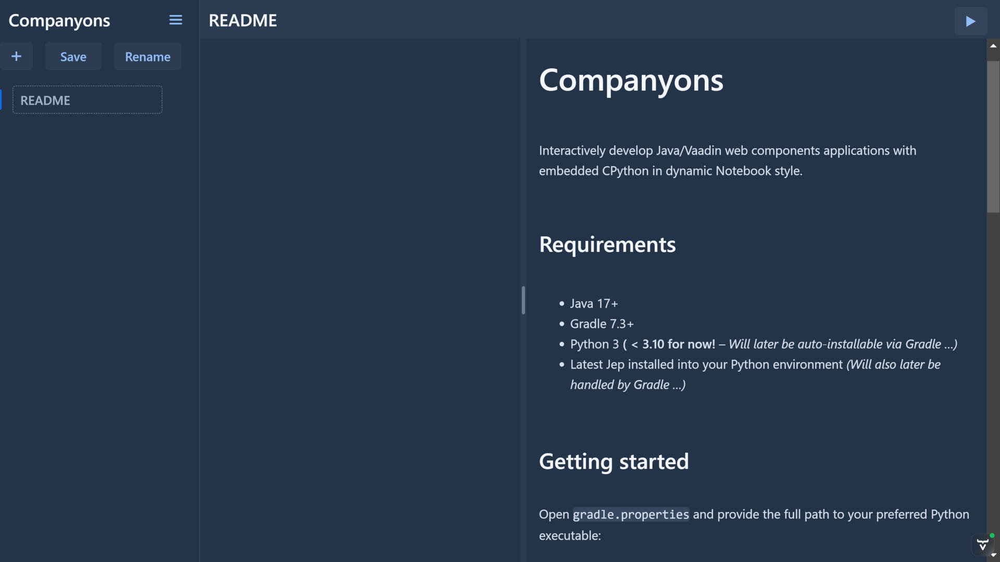
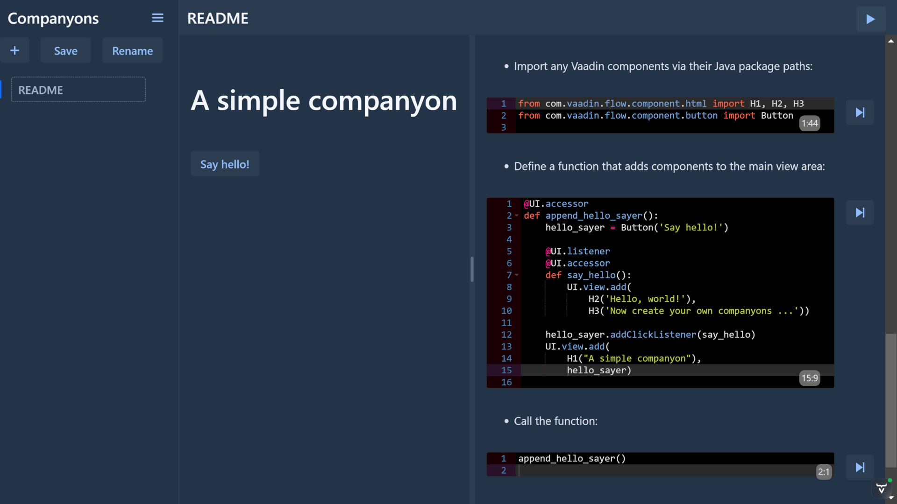
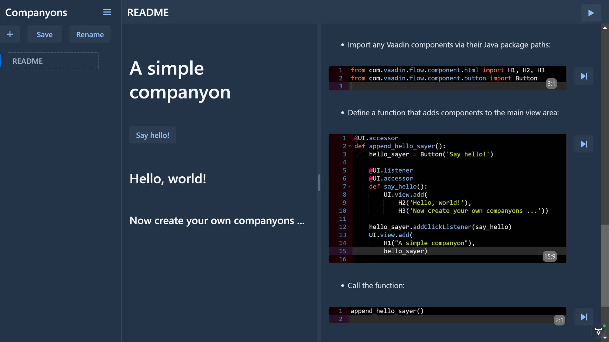

# Companyons

Interactively develop Java/[Vaadin](https://vaadin.com) web
[components](https://webcomponents.org) applications with embedded
CPython in dynamic Notebook style.

## Requirements

* Java 17+
* [Gradle](https://gradle.org) 7.3+
* Python 3 **( < 3.10 for now!** – _Will later be auto-installable via Gradle …)_
* Latest [Jep](https://github.com/ninia/jep) installed into your Python environment
  _(Will also later be handled by Gradle …)_

## Getting started

Open `gradle.properties` and provide the full path to your preferred
Python executable:

```properties
pythonExe = /path/to/your/bin/python
```

Or, on Windows, respectively:

```properties
pythonExe = C:\\path\\to\\your\\python.exe
```

Then, run the Companyons backend with:

```shell
> gradle bootRun
```

Which will automatically download all Java dependencies, build the
project, and finally open its frontend in your default web browser.

## Hello, world!

All Markdown files from your working directory are automatically loaded
as companyon apps. So is this `README.md` loaded on startup:



* The right-side console can be resized using the draggable handle at its
left border.

---

All fenced code blocks of `python` type are loaded as executable code,
and appear in editor widgets within the console – like those from this
simple example:

* Import any Vaadin components via their Java package paths:

```python
from com.vaadin.flow.component.html import H1, H2, H3
from com.vaadin.flow.component.button import Button
```

* Define a function that adds components to the main view area:

```python
@UI.accessor
def append_hello_sayer():
    hello_sayer = Button('Say hello!')

    @UI.listener
    @UI.accessor
    def say_hello():
        UI.view.add(
            H2('Hello, world!'),
            H3('Now create your own companyons ...'))

    hello_sayer.addClickListener(say_hello)
    UI.view.add(H1("A simple companyon"), hello_sayer)
```

* Call the function:

```python
append_hello_sayer()
```

---

By clicking on the step-forward buttons next to the editor widgets,
their code is executed in the Python sub-interpreter attached to the
README app:



---

Now click on the new `Say hello!` button and see what happens:


